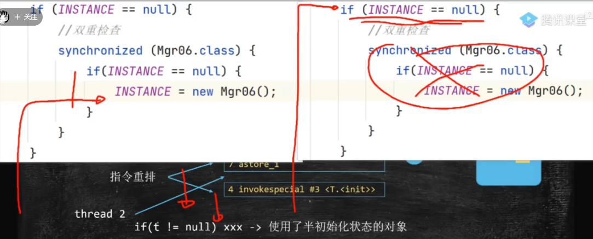

# java concurrent programming 
## process/ thread / co-routines
process是重量级别，操作系统中一个进程，它可以有n多个线程 thread，
进程之间是相互隔离的，每个进程有自己的内存空间和资源。
线程是单独的，每个进程中的线程共享进程的内存空间和资源，thread lightweighted。
co-routine最近出的新概念，类似于thread，但可以看作更轻量级的thread，是受用户调度的，不是操作系统的调度？
go-goroutine
java/python  co-routine？/
感觉这个co-routine理解的不好

## how to create thread in java 
继承yhread，实现runnable，callable
exutor service/future

## thread lifecycle
start（） run（） join(), sleep(), wait(), notify(),terminated()

## how to communicate each other thread?
1. wait
2. notify
3. yield
4. join

## Lock interface and advanced usage:
synchronized 关键字: 直接上锁，对象上锁，代码块上锁，可重入，内允许嵌套
ReentrantLock
1. ReentrantReadWriteLock： 这种锁维护了一对相关的锁，有点像之前的COW容器，适合读多写少，比如缓存
2. StampedLock :新型的读写锁，它在功能上类似于ReentrantReadWriteLock，但提供了更灵活的锁控制机制，能够进一步优化读 - 写场景下的并发性能

## condition interface?
Lock是个接口，condition也是个接口，Condition 接口通常是与 Lock 接口一起使用的，因为它是通过 Lock 对象的 newCondition() 方法来创建的。

## no lock programing and CAS
1. no lock
2. CAS
3. Atomic family 

## Fork/join framework
1.XXX
2. handle concurrent tasks

## completable Futures and async programming
1. chain programming 
2. whats the scenario

## thread pool, executor 

# advanced
到JVM JMM，操作系统的层面，
## 并发和并行
## atomic operation
## cacheline and false sharing

一个缓存行可以存储多个变量（存满当前缓存行的字节数）；而CPU对缓存的修改又是以缓存行为最小单位的，
在多线程情况下，如果需要修改“共享同一个缓存行的变量”，就会无意中影响彼此的性能，这就是伪共享（False Sharing）。
false sharing不好因为会降低性能，那怎么办能把X，y分开存储呢？

solution：
1.可以使用数据填充的方式来避免伪共享，即单个数据填充满一个CacheLine。这本质是一种空间换时间的做法。
  使得数据能够完整地存储在一个或多个缓存行中，避免数据跨越多个缓存行
2.@sun.misc.Contented  不知道为啥这个注解不好用，总之就推荐padding line

java -XX:+UnlockDiagnosticVMOptions -XX:+PrintAssembly VolatileDemo --> 汇编，第一个选项干啥的？
--Error: VM option 'PrintAssembly' is diagnostic and must be enabled via -XX:+UnlockDiagnosticVMOptions.
--Error: The unlock option must precede 'PrintAssembly'.

先用javac编译然后再用java生成汇编代码
javac VolatileDemo.java
java -cp . -XX:+UnlockDiagnosticVMOptions -XX:+PrintAssembly demo.jmm.VolatileDemo >> temp.txt
要装个hsids 不然还是看不到

`volatile` 关键字可以禁止指令进行重排序优化，强制刷回主存 对所有线程可见。但不会保证原子性

查看对象布局：JOL

show bytecode 可以查看到一点东西
javap -v VolatileDemo.class （哪个版本的jdk都有，底层一个工具）

## 关于加锁
最简单的程序：一个整数n，100个线程，每个线程对加1000次，最终结果=100*1000=100000.

double check lock
DCL到底需不需要volatile？要，volatile会禁止指令重拍，怕就怕指令重排导致初始化一半的对象 被拿来用

这里还有一个比较深的点是为什么istance外层有锁还可以被另外一个线程访问？ 
上锁上的是代码块 而不是instance本身， 第一个instance==null没有上锁，可以被其他线程尽情访问。。

CAS:

问了doubao，给了一些task：
初级难度
1. 线程交替打印奇偶数
   题目描述：编写一个程序，创建两个线程，一个线程打印奇数，另一个线程打印偶数，要求输出结果是按照顺序从 1 到 100 的数字。
   示例代码思路：可以使用 synchronized 关键字和 wait()、notify() 方法来实现线程间的同步。
2. 生产者 - 消费者模型
   题目描述：实现一个简单的生产者 - 消费者模型，生产者线程不断向一个共享队列中添加元素，消费者线程从队列中取出元素进行消费。队列有固定的容量，当队列满时，生产者线程需要等待；当队列为空时，消费者线程需要等待。
   示例代码思路：可以使用 synchronized 关键字和 wait()、notifyAll() 方法来实现线程间的同步，或者使用 BlockingQueue 来简化实现。
3. 打印顺序控制
   题目描述：有三个线程，分别打印 A、B、C，要求按顺序依次打印 ABC，循环 10 次。
   示例代码思路：可以使用 synchronized 关键字结合 wait() 和 notify() 方法，通过标志位来控制线程的执行顺序。
中级难度
1. 多线程文件下载器
   题目描述：编写一个多线程文件下载器，将一个大文件分成多个小块，每个线程负责下载一个小块，最后将所有小块合并成一个完整的文件。
   示例代码思路：可以使用 Java 的 RandomAccessFile 类来实现文件的随机读写，通过多线程并行下载不同的文件块，最后合并文件。
2. 线程池的使用
   题目描述：创建一个线程池，向线程池中提交多个任务，每个任务打印当前线程的名称和任务编号，观察线程池的工作原理和线程复用情况。
   示例代码思路：使用 Executors 类创建不同类型的线程池（如 FixedThreadPool、CachedThreadPool 等），并使用 execute() 或 submit() 方法提交任务。
3. 并发计数器
   题目描述：实现一个并发计数器，多个线程可以同时对计数器进行递增操作，要求计数器的操作是线程安全的。
   示例代码思路：可以使用 AtomicInteger 类来实现无锁的并发计数器，也可以使用 synchronized 关键字或 ReentrantLock 来保证线程安全。
高级难度
1. 多线程排序算法
   题目描述：实现一个多线程的排序算法，如多线程归并排序。将一个大数组分成多个小数组，每个线程负责对一个小数组进行排序，最后将排序好的小数组合并成一个大数组。
   示例代码思路：使用递归和线程池来实现多线程归并排序，通过 Future 和 Callable 接口获取每个线程的排序结果，并进行合并。
2. 实现一个简单的线程安全的缓存系统
   题目描述：设计并实现一个线程安全的缓存系统，支持缓存的添加、查询和删除操作，当缓存达到一定容量时，需要实现缓存淘汰策略（如 LRU 算法）。
   示例代码思路：可以使用 ConcurrentHashMap 来实现线程安全的缓存存储，结合 LinkedHashMap 实现 LRU 缓存淘汰策略。
3. 模拟银行转账系统
   题目描述：模拟一个银行转账系统，多个线程可以同时进行转账操作，要求保证账户余额的一致性和转账操作的原子性，处理可能出现的死锁情况。
   示例代码思路：使用 synchronized 关键字或 ReentrantLock 来保证账户操作的线程安全，通过合理的加锁顺序来避免死锁。